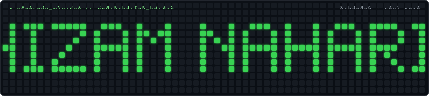

 
# Hizam Nahari
### *Teknisi Elektronika & Otomasi Sistem • Sidoarjo, Indonesia*

  <b>"Biasa megang jalur motherboard di meja servis, lalu bikin otomasi biar kerjaan beres lebih cepat."</b>

  <a href="./README.md">

  <a href="https://megapass.web.id/teknisi/">

  
  
  
  

---

## 🔧 Tentang Saya & Meja Servis
Saya teknisi elektronika dan pemilik **Megapass Intra Solusindo** di Sidoarjo. Keseharian saya berhadapan langsung deng…
Saya mulai coding bukan untuk gaya-gayaan bikin portofolio, tapi murni karena butuh alat bantu saat servis:
- Capek hafalin perintah terminal tiap kali mau flash BIOS laptop $\rightarrow$ Saya bikin **CH341A Flasher GUI**.
- Repot hapus aplikasi bawaan (*bloatware*) di puluhan HP servisan satu-satu $\rightarrow$ Saya bikin **ADB Uninstaller…
- Hijrah ke Linux (**Kubuntu 26.04**) dan ngerasa ribet pas mau ekstrak file arsip di jendela dialog import $\rightarro…
> **Prinsip Kerja**: *"Kalau masalahnya bisa selesai pakai script ringan yang 0% beban CPU, ya itu yang dipakai. Gak pe…
---
## 📜 Sertifikasi & Pelatihan Resmi
Keahlian servis dan hardware saya didasari oleh sertifikasi profesi nasional dan pelatihan resmi:
| Lembaga | Bidang Kompetensi | Keterangan |
|---|---|---|
| 🏆 **BNSP** | Reparasi Telepon Seluler | **Nilai Teori Sempurna (100/100)** pada ujian elektronika & sirkuit |
| 🔬 **BMY Yogyakarta** | Spesialis Motherboard Laptop & Skematik | Analisa motherboard mati total & no display pakai os…
| 🎓 **ITS Surabaya (PRODISTIK)** | D1 Teknologi Informasi | Dasar kelistrikan, pembuatan jalur PCB, & teknik solder pre…
| 📱 **PTC Indonesia & Arsalabs** | Servis HP Lanjutan & Angkat Pasang IC | Reball IC, pelacakan jalur tegangan, & penan…
| 💻 **Magistra Utama** | Hardware & Jaringan Komputer | Teknisi hardware komputer, instalasi jaringan, & dasar web |
| 🤝 **TESPOIN** | Asosiasi Teknisi Ponsel Indonesia | Anggota resmi asosiasi teknisi nasional |
👉 *Foto fisik sertifikat dan meja servis bisa dilihat langsung di:* **[megapass.web.id/teknisi](https://megapass.web.id…
---
## 💻 Alat & Teknologi yang Dipakai

  
| Bidang | Alat & Bahasa | Penggunaan Nyata |
|---|---|---|
| **Hardware & Servis** | CH341A Flasher, `flashrom`, Multitester, Osiloskop, Boardview | Angkat pasang IC, baca skema …
| **Linux & Desktop** | KDE Plasma 6, Wayland, Bash Script, `inotifywait`, Systemd | Bikin background service otomatis …
| **Aplikasi Desktop GUI** | Tauri v2, Rust, React, TypeScript, Vite | Bikin tampilan GUI desktop yang kencang dan ente…
| **Web & Dashboard** | Python (FastAPI, Flask), HTMX, Tailwind CSS v4, SQLite | Bikin sistem dashboard bengkel dan web…
---
## ⚡ Proyek yang Lahir dari Meja Servis
### 🚀 [Auto-Extract Downloads for Linux](https://github.com/4ntiDandruff/auto-extract-downloads)
**Background Service Ekstraksi Arsip Otomatis untuk Linux Desktop (KDE/GNOME)**  
Mengatasi ribetnya ekstrak file saat mau import berkas di Linux. Berjalan otomatis di background via event kernel (`ino…
`Shell` • `inotify-tools` • `Systemd User Unit` • `libnotify` • `unar/7z`
### 🔌 [CH341A BIOS Flasher Tauri](https://github.com/4ntiDandruff/CH341A-BIOS-Flasher-Tauri)
**Aplikasi GUI Desktop untuk Alat Flash CH341A USB**  
Aplikasi pembungkus engine `flashrom` untuk meja servis laptop. Menghilangkan repotnya ketik perintah terminal, bisa de…
`Tauri v2` • `Rust` • `TypeScript` • `Python` • `flashrom`
### 🤖 [ADB Uninstaller](https://github.com/4ntiDandruff/adb-uninstaller)
**Aplikasi Debloat Android dengan Bantuan AI**  
Alat bantu servis HP untuk menghapus aplikasi bawaan secara massal (*batch*) di banyak HP sekaligus via kabel USB, leng…
`Tauri v2` • `React` • `TypeScript` • `Android Debug Bridge (ADB)`
### 🌐 [kalenderia.my.id](https://github.com/4ntiDandruff/kalenderia.my.id)
**Sistem Web & Percetakan Kalender Sidoarjo**  
Aplikasi web komersial untuk workshop percetakan kalender di Sidoarjo. Dibuat pakai pendekatan *no-build* (Flask + HTMX…
`Python Flask` • `HTMX` • `Tailwind CSS v4` • `Jinja2`
---
## 📈 Grafik Kontribusi

  
---

  <a href="https://megapass.web.id">
*Dibuat langsung dari meja servis Megapass • Sidoarjo, Jawa Timur, Indonesia.*

[raw output: artifact://318]

Wall time: 0.06 seconds