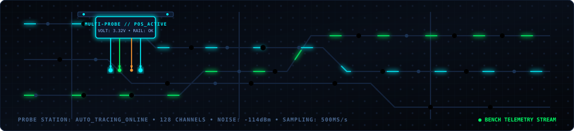

  

  <b>"I trace dead rails on the repair bench, then build lightweight tools to automate the rest."</b>

  
  

  
  
  
  

  
  
  
  

---

## 🔧 About Me & The Repair Bench

I am a certified electronics technician running **Megapass Intra Solusindo**, a diagnostics and board-level repair shop in Sidoarjo, Indonesia. My daily drivers are hot air stations, digital multimeters, oscilloscopes, and boardviews — diagnosing motherboard shorts, tracking voltage drops, and soldering micro ICs on laptops and smartphones.

I don't code to pad a portfolio. Every tool here was built to solve a real bottleneck on the repair bench:
- Flashing BIOS chips through cryptic terminal commands got tedious $\rightarrow$ Built **CH341A Flasher GUI**.
- Debloating customer phones manually one by one was a waste of time $\rightarrow$ Built **ADB Uninstaller**.
- Moved to Linux (**Kubuntu 26.04**) and got annoyed by archive extraction friction in file dialogs $\rightarrow$ Built **Auto-Extract Downloads** daemon.

> **Bench Rule**: *"If a simple shell script or native daemon gets the job done with 0% CPU overhead, that's what ships. No bloat, no needless complexity."*

---

## 📜 Official Certifications & Training

All hardware and software work is backed by national standard certifications and formal technical training:

| Organization | Specialization | Highlights |
|---|---|---|
| 🏆 **BNSP (National Agency)** | Cellular & Electronics Repair | **Perfect Theory Score (100/100)** on circuit architecture & electronics |
| 🔬 **BMY Yogyakarta** | Laptop Motherboards & Schematics | No-power / no-display board diagnostics using oscilloscopes |
| 🎓 **ITS Surabaya (PRODISTIK)** | D1 Information Technology | Circuit design, PCB fabrication, & precision soldering |
| 📱 **PTC Indonesia & Arsalabs** | Advanced Phone & IC Repair | Micro-soldering, IC reballing, power-rail tracing, & dead phone recovery |
| 💻 **Magistra Utama** | Hardware & Computer Networks | Hardware maintenance, networking, & web development |
| 🤝 **TESPOIN** | Indonesian Mobile Technicians | Official national technician association member |

👉 *Physical certificates and bench setup:* **[megapass.web.id/teknisi](https://megapass.web.id/teknisi/)**

---

## 💻 Tech & Tools I Use Daily

  

| Domain | Tools & Stack | Real-World Application |
|---|---|---|
| **Hardware & Bench** | CH341A Programmer, `flashrom`, Multimeter, Oscilloscope, Boardview | IC replacement, motherboard schematics, BIOS/UEFI firmware recovery |
| **Linux & Desktop** | KDE Plasma 6, Wayland, POSIX Bash, `inotifywait`, Systemd | Lightweight background services with zero polling and minimal memory |
| **Desktop GUIs** | Tauri v2, Rust, React, TypeScript, Vite | Fast, responsive native desktop GUIs wrapping lower-level hardware CLIs |
| **Web & Ops** | Python (FastAPI, Flask), HTMX, Tailwind CSS v4, SQLite | Clean, fast shop dashboards and production websites without JS bloat |

---

## ⚡ Shop-Tested Projects

### 🚀 [Auto-Extract Downloads for Linux](https://github.com/4ntiDandruff/auto-extract-downloads)
**Event-Driven Archive Extraction Daemon for Linux Desktop (KDE/GNOME)**  
Fixes archive extraction friction during file-picker imports in Linux. Runs seamlessly in the background via kernel events (`inotify`) with **0% idle CPU** and **~1.5 MB RAM**. Features 9 built-in safety fuses (self-compression loop guard, disk space cutoff, image protection).  
`Shell` • `inotify-tools` • `Systemd User Unit` • `libnotify` • `unar/7z`

### 🔌 [CH341A BIOS Flasher Tauri](https://github.com/4ntiDandruff/CH341A-BIOS-Flasher-Tauri)
**Desktop GUI for the CH341A USB Programmer**  
Wraps the `flashrom` engine for laptop repair benches. Eliminates the need to memorize CLI flags, auto-detects IC models, verifies read/write integrity, and keeps BIOS flashing safe.  
`Tauri v2` • `Rust` • `TypeScript` • `Python` • `flashrom`

### 🤖 [ADB Uninstaller](https://github.com/4ntiDandruff/adb-uninstaller)
**AI-Assisted Android Debloater**  
Batch-removes vendor bloatware across multiple USB-connected customer devices, complete with a package safety guide to avoid bricking phones.  
`Tauri v2` • `React` • `TypeScript` • `Android Debug Bridge (ADB)`

### 🌐 [kalenderia.my.id](https://github.com/4ntiDandruff/kalenderia.my.id)
**Production Printing Engine & Workshop System**  
Commercial web application for calendar printing in Sidoarjo. Built with a strict no-build philosophy (Flask + HTMX) for instant page loads.  
`Python Flask` • `HTMX` • `Tailwind CSS v4` • `Jinja2`

---

## 📈 Hardware Diagnostics & Contribution Stream

  

---

  
  

*Built on the Megapass repair bench • Sidoarjo, East Java, Indonesia.*

